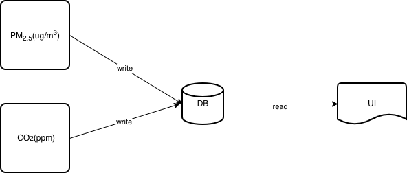

# Global Open Indoor Air Quality Score

## Introduction

The goal of this project is to provide an implementation in software of the proposed Global Open Indoor Air Quality Score (GO IAQS).

The user interface is developed in Python and HTML in order to be shown in a web browser. The AQ data is read periodically from a database and shown in real time.
The database is filled with AQ data using separate Python scripts, such that there is no direct coupling between the logic that reads data from sensors and the logic that shows data in the user interface.

The AQ system diagram is shown below:

